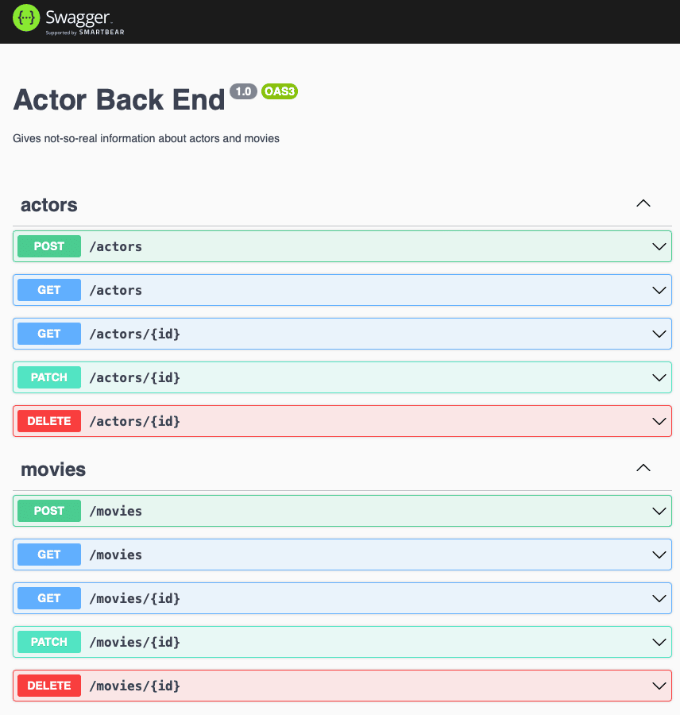

# Actor Back End

This is an API back-end using NestJS and an in-memory SQLite database. It stores actor and movie information, whose
schemas are loosely based on [TMDB API models](https://developers.themoviedb.org/3).

## Requirements

- Internet access is required to install dependencies, but the API itself is standalone.
- Node.JS 16 and npm

## Running the Application

1. Clone this repository.
2. Run `npm install` in the root of the cloned directory.
3. Run `npm start`.
4. (optional) Access Swagger UI at `http://localhost:3000/api`.

## Running Unit Tests

Run `npm test` in the root of the cloned directory, assuming that `npm install` has been run.

## Running End-to-End Tests

Run `npm run test:e2e` in the root of the cloned directory, assuming that `npm install` has been run.

## External Libraries

- [@nestjs/core](https://www.npmjs.com/package/@nestjs/core): This and other sibling libraries allow NestJS to work.
- [@nestjs/mapped-types](https://www.npmjs.com/package/@nestjs/mapped-types): Allows for painless mapping from DTOs to database entities.
- [@nestjs/swagger](https://www.npmjs.com/package/@nestjs/swagger): Enables Swagger to dynamically generate interactive API documentation.
- [@nestjs/typeorm](https://www.npmjs.com/package/@nestjs/typeorm): Uses the very effective [TypeORM](https://typeorm.io) to interact with the database using a readable JavaScript API.
- [helmet](https://www.npmjs.com/package/helmet): Applies a broad-stroke blanket of security by adding security headers and handling unsafe requests.
- [mysql2](https://www.npmjs.com/package/mysql2): Enables use of the in-memory database.
- [eslint](https://www.npmjs.com/package/eslint): Ensures correctness of TypeScript source code (for development).
- [prettier](https://www.npmjs.com/package/prettier): Eases code formatting and consistency (for development).
- [supertest](https://www.npmjs.com/package/supertest): Makes end-to-end API testing easy and simple.

## Assumptions

- Adding the many-to-many relation between an `Actor` and a `Movie` has value for theoretical future development, even though it's not utilised in this example.
- The use of mixed endpoint calls in the end-to-end tests, though violating the single responsibility principle, is deemed acceptable for the level of simplicity of this challenge.
- Error handling can also be ignored for the simplicity of the sample challenge, though this would be vigorously covered in a realistic production scenario.
- The same goes as above for authentication and authorisation.
- The similarity between controllers, services, and tests between actor-related and movie-related code would be likely to change as the models and API logic change, and so isn't worth abstracting into a common set of code.
